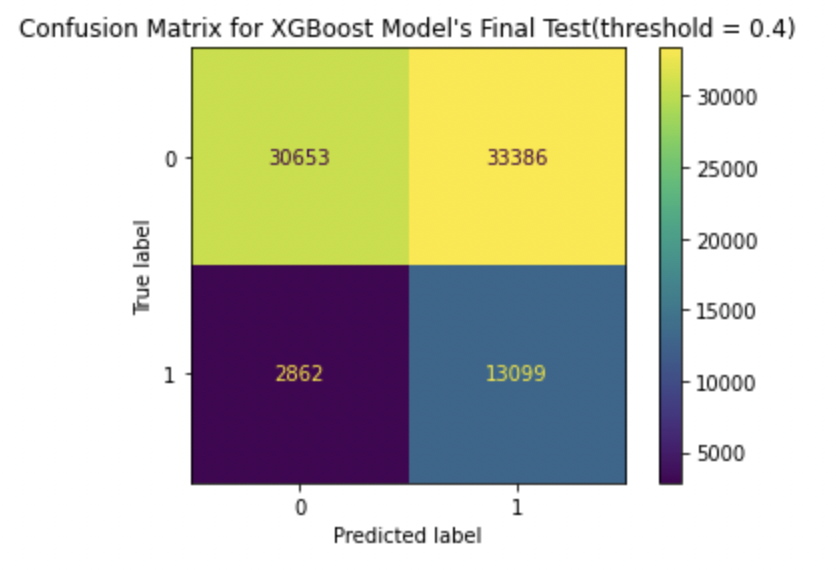
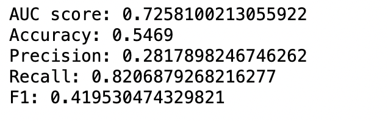
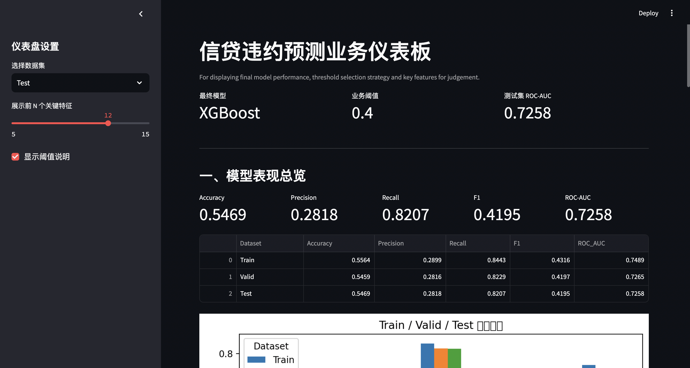

# credit-default-prediction
A credit default prediction project using Python, using logistic regression and  random  forest models.
## Key Highlights
- Built end-to-end credit default prediction workflow from preprocessing to model evaluation
- Compared Logistic Regression, Random Forest, and XGBoost
- Evaluated multiple probability thresholds 
- Focused on the trade-off between recall and precision in a credit risk setting
- Developed an initial Streamlit dashboard for business-facing model demonstration

## 1. Project Overview
This project aims to build a credit default prediction model based on borrower historical information, loan features, and credit-related variables. The target variable is `isDefault`, and the task is a binary classification problem.

From a business perspective, the goal is to identify high-risk borrowers and support credit approval and risk management decisions.

## 2. Dataset
- Source: This project is based on the Tianchi credit default dataset. https://tianchi.aliyun.com/dataset/140861
- Size: The dataset contains 800,000 observations and 47 variables, including borrower characteristics, loan information, and anonymized numerical features.
- Target Feature: 'IsDefault'

## 3. Project Workflow
### 3.1 Project Background and Objective
- Define the business problem of credit default prediction
- Clarify the modeling objective and risk-control scenario
### 3.2 Environment and Tools
- Python
- Pandas / NumPy
- Matplotlib / Seaborn
- Scikit-learn
- XGBoost
- Streamlit
### 3.3 Data Exploration
- Basic data overview
- Variable type identification and classification
- Date field processing and feature construction
- Missing value analysis
- Duplicate detection
- Outlier detection
- Exploratory data analysis (EDA)
  - Target variable analysis
  - Numerical feature analysis
  - Categorical feature analysis
- Preliminary findings and conclusions
### 3.4 Train-Test Split
- Split the dataset into training and validation/testing sets
- Preserve class distribution where necessary
### 3.5 Feature Grouping
- Group variables by type and preprocessing needs
- Prepare for pipeline-based transformation
### 3.6 Data Processing Pipeline Design
- Design principles of the preprocessing pipeline
- Core modules included in the preprocessor
- Preprocessing output and transformed dataset structure
### 3.7 Logistic Regression
- Model construction
- Performance evaluation
- Threshold sensitivity analysis
- Visualization:
  - ROC curve
  - Precision-Recall curve
  - Confusion matrix at threshold = 0.4
- Initial optimization
### 3.8 Random Forest
- Model construction
- Performance evaluation
- Threshold sensitivity analysis
- Visualization:
  - ROC curve
  - Precision-Recall curve
  - Confusion matrix at threshold = 0.4
### 3.9 Model Comparison and Preliminary Interpretation
- Compare Logistic Regression, Random Forest, and XGBoost
- Interpret results from a business and risk-management perspective
### 3.10 XGBoost
- Baseline model construction
- Performance evaluation
- Further tuning and optimization

## 4. Key Results
- Compared multiple thresholds
- Emphasized recall-risk tradeoff
- Selected model based on business needs
- Final XGBoost Model Performance Visualization (at threshold 0.4)

## 5. Dashboard Preview

## 6. Future Improvements

## Author
Leer Zheng 
